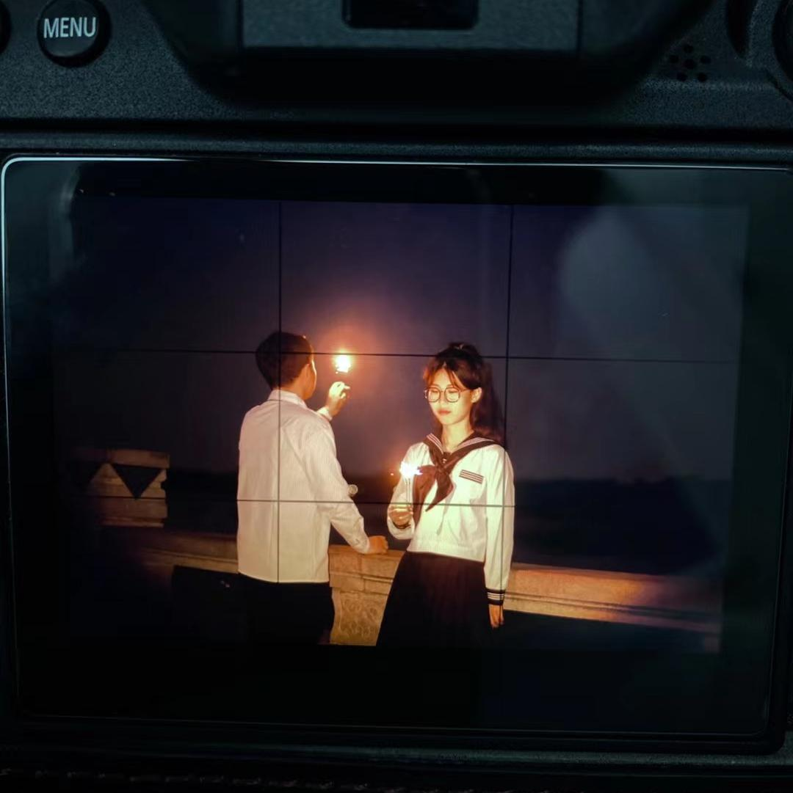
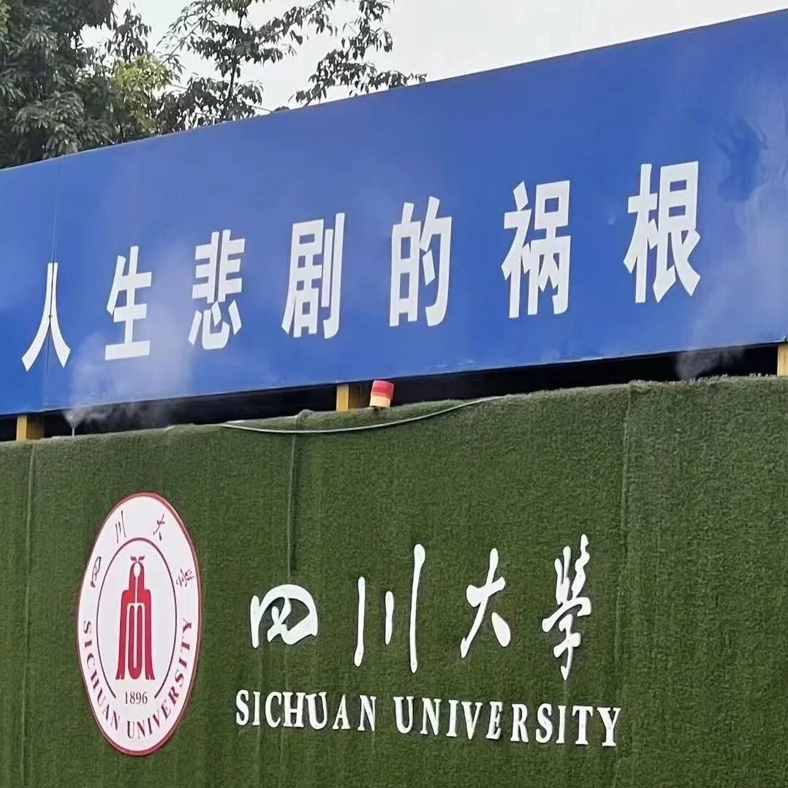
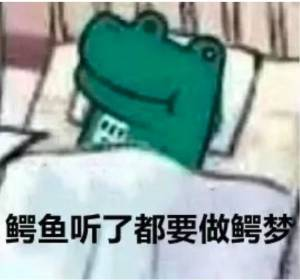
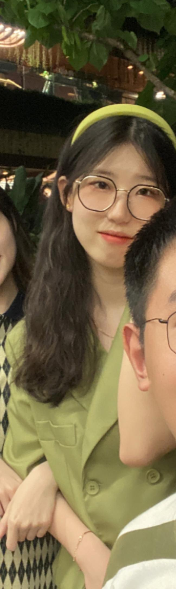
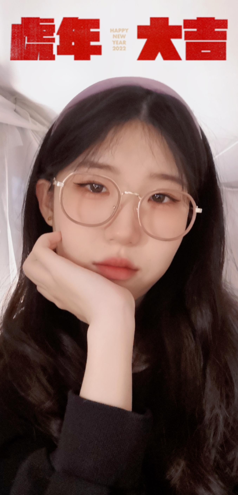

# Welcome to Meet Me

Hi, my Chinese name is **Xing xinyi**.
My English name is also Xing xinyi.

(It shows the loneliness in the author's heart
and the helplessness of not having an English name.)

(考虑到我本人也看不懂我写了什么，接下来我将使用中文来写一些介绍。)

这是我本体。

这是我。

(虽然看不清楚脸，但是这不重要，这张照片有七分网图的氛围，剩下九十三分我尽力了。)

我是毕业于四川大学的本科生。

(bushi)

我学的专业是给排水科学与工程，一个下属于土木的二级学科。
(ps：就是那个要下工地的土木)
(pps：这是我换专业的原因之一)
(ppps：另一个原因是我没收到设计院的offer)
(4ps:当然，最重要的原因还是因为我热爱代码！！！)

我是西安人，工作地也是西安，就是从家去公司比从家去咸阳还久。

我的废话讲完了，应该是除了coach没人看的，接下来我将按照要求放几张照片（p的）以便让有缘人提前认识认识我的脸（希望能认出来吧）。

